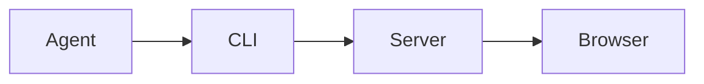

# Deployment flow

This Markdown file is an executable publication example.

| Stage | Owner | State |
| --- | --- | --- |
| Build | CI | complete |
| Publish | Agent | ready |



```go
ctx, cancel := context.WithTimeout(parent, 30*time.Second)
defer cancel()
```
