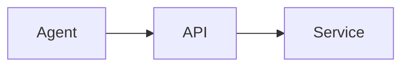

# agent-whiteboard Master Technical Design

**Status:** Approved design, implementation plans complete

**Source:** `Product Requirements Document: agent-whiteboard` (21 pages)

**Goal:** Build a self-hosted Go application and reusable library that lets trusted AI agents publish, update, view, and delete Markdown, standalone HTML, and image artifacts through a CLI or versioned HTTP API.

## 1. Scope

The first release provides:

- A binary named `agent-whiteboard`.
- A thin public Go facade at `pkg/agentwb`.
- Framework-independent whiteboard and image services.
- A standard `net/http` adapter and convenience server lifecycle.
- Local filesystem storage and externally implementable storage interfaces.
- Browser-rendered Markdown with bundled Markdown, sanitization, Mermaid, and syntax-highlighting assets.
- Standalone trusted HTML serving.
- PNG, JPEG, GIF, and WebP images.
- Full-content replacement, deletion, and configurable expiration.
- Human-readable and versioned JSON CLI output.
- Hermetic unit, component, process integration, and browser integration tests.
- An agent skill at `skills/agent-whiteboard/SKILL.md`.

The first release does not add authentication, accounts, multi-tenancy, listing, search, history, collaborative editing, a management UI, Docker, Windows support, a public Go HTTP client, asset bundles, or arbitrary downloads.

## 2. Intentional PRD Refinements

The approved design deliberately refines these original PRD details:

1. The server returns stable resource paths, not deployment-specific absolute URLs. The CLI and agent combine the configured `--server` origin with the returned path.
2. Markdown is rendered in the browser by the server-managed viewer shell. The server stores Markdown source and injects it safely into the shell; it does not convert Markdown to HTML.
3. Public Markdown, HTML, and image responses are accessible to anyone with the URL but explicitly marked as non-indexable and non-archivable.
4. Image management and viewing routes use only the image ID. Public image URLs do not contain an extension.
5. Image updates may change between supported image formats while preserving the public ID and path.
6. Upload limits have configurable defaults: 10 MiB per Markdown/HTML document, 25 MiB per image, and 100 MiB per multi-image request.
7. A filesystem root is owned by one server process. Multiple processes sharing one root are unsupported.
8. Filesystem locking is granular per resource and uses standard-library synchronization only.

These refinements take precedence over conflicting wording in the source PRD.

## 3. Technical Baseline

- Module: `github.com/edocsss/agent-whiteboard`
- Minimum Go version: Go 1.25
- Supported toolchains in CI: Go 1.25 and Go 1.26
- Supported operating systems: macOS and Linux
- CLI: Cobra v1.10.2
- Logging: standard-library `log/slog`
- Mock generation: Mockery v3.7.1
- Mock runtime and assertions: Testify v1.11.1
- Browser-tooling runtime: Node.js 24.x
- JavaScript package manager: pnpm 11.4 with a committed lockfile
- Markdown renderer: markdown-it 14.2.0
- Sanitizer: DOMPurify 3.4.12
- Mermaid: full Mermaid 11.15.0
- Syntax highlighting: highlight.js 11.11.1
- Browser integration: Playwright 1.61.1 with pinned Chromium

Generated browser bundles and generated Go mocks are committed. Normal Go builds and tests do not require network access, Node.js, a mock generator, or a public CDN.

## 4. Package Structure

```text
cmd/agent-whiteboard/
  main.go

pkg/agentwb/
  agentwb.go
  config.go
  service.go
  storage.go
  types.go
  errors.go

internal/
  common/
    clock.go
    id.go
    expiration.go
    errors.go

  whiteboard/
    model.go
    service.go
    store.go
    markdown.go
    html.go
    viewer.go
    handler.go

  image/
    model.go
    service.go
    store.go
    format.go
    handler.go

  store/
    fs.go

  assets/
    assets.go
    src/
    dist/
    licenses/

  http/
    http.go
    client.go

  app/
    app.go
    server.go

  cli/
    cli.go
    serve.go
    whiteboard.go
    image.go
    output.go

tests/
  integration/
  browser/

skills/agent-whiteboard/
  SKILL.md
```

### 4.1 Package responsibilities

`pkg/agentwb` is the only public application package. It exposes `agentwb.New`, `agentwb.Config`, `agentwb.Service`, public inputs/results/errors, store interfaces, handler access, and convenience lifecycle operations. It forwards to internal implementations and contains no duplicated business logic.

`internal/common` contains only cross-domain primitives. Files are named after their responsibility rather than collecting unrelated helpers:

- `clock.go`: system and injected clock contracts.
- `id.go`: cryptographically random ID generation and validation.
- `expiration.go`: creation/update expiration calculation.
- `errors.go`: stable domain error codes and wrapping.

`internal/whiteboard` owns Markdown and HTML models, service operations, its required storage interface, document validation, viewer-shell generation, and whiteboard HTTP handlers.

`internal/image` owns image models, service operations, its required storage interface, signature detection, allowlisting, and image HTTP handlers.

`internal/store/fs.go` contains the complete filesystem implementation: directory layout, metadata encoding, safe replacement, per-resource locks, expiration enforcement, cleanup, readiness, and closure. Because Go cannot overload the same method names for different domain record types, one `FS` exposes thin `Whiteboards()` and `Images()` views that implement the two domain-owned store interfaces while sharing the same filesystem state and lifecycle. The views and all implementation logic remain in `fs.go`.

`internal/assets` owns browser source, compiled assets, embedding, and third-party license notices. Assets are not nested under the whiteboard domain.

`internal/http` owns shared HTTP protocol structures, route constants, JSON helpers, multipart helpers, and the private outbound client used by the CLI. Domain handlers remain inside their business packages.

`internal/app` is the composition root. It injects stores and common dependencies into domain services, mounts domain handlers, exposes health endpoints, and coordinates server lifecycle.

`internal/cli` owns argument parsing, configuration precedence, presentation, process signals, and server startup. `cmd/agent-whiteboard/main.go` only calls the CLI package.

### 4.2 Dependency direction

```text
CLI -> private HTTP client -> domain HTTP handlers -> domain services
                                                    -> domain store interfaces

filesystem store -> domain-specific views --implements--> domain store interfaces

public facade -> app -> whiteboard service
                     -> image service
                     -> filesystem store/defaults
```

Business domains do not reach into another domain's storage. If a future whiteboard operation needs image-domain behavior, it receives a narrow image-service interface through dependency injection.

## 5. Dependency Injection

All non-value dependencies use constructor injection. There are no package-global services, mutable singletons, reflection-based containers, or service locators.

Production composition is equivalent to the following (error handling omitted for brevity):

```go
whiteboards, _ := whiteboard.NewService(whiteboardStore, clock, idGenerator, defaultExpiration)
images, _ := image.NewService(imageStore, clock, idGenerator, defaultExpiration, logger)
viewer, _ := whiteboard.NewViewer(whiteboard.ViewerConfig{CSS: viewerCSS, JS: viewerJS})
whiteboardHTTP, _ := whiteboard.NewHandler(whiteboards, viewer, whiteboardHandlerConfig)
imageHTTP, _ := image.NewHandler(images, imageHandlerConfig)
application, _ := app.New(app.Config{
    Whiteboards: whiteboardHTTP,
    Images: imageHTTP,
    Readiness: []app.Readiness{whiteboardStore, imageStore},
})
```

The public `agentwb.New(Config, ...Option)` constructor chooses production defaults only when the caller omits optional overrides. Internal constructors require their dependencies explicitly and reject nil required dependencies.

Mock boundaries are deliberately narrow:

- Whiteboard service -> whiteboard store, clock, and ID generator.
- Image service -> image store, clock, and ID generator.
- Whiteboard handler -> whiteboard operation interface.
- Image handler -> image operation interface.
- App -> whiteboard and image service interfaces.
- CLI commands -> private HTTP client interface.
- Server lifecycle -> readiness and closing interfaces.

Mockery generates typed Testify-backed mocks. Generated files are checked in, and `.mockery.yaml` is committed. Full integration and browser tests never use mocks.

## 6. Public Go API

The exact public types may be aliases of internal domain types where doing so avoids conversion layers. External consumers import only `github.com/edocsss/agent-whiteboard/pkg/agentwb` and never import `internal`.

### 6.1 Configuration

```go
type Config struct {
    WhiteboardStore WhiteboardStore
    ImageStore      ImageStore

    RootDir                 string
    DefaultExpirationSeconds int64
    CleanupInterval          time.Duration

    Host            string
    Port            int
    ShutdownTimeout time.Duration

    MaxWhiteboardBytes   int64
    MaxImageBytes        int64
    MaxImageRequestBytes int64

    LogMode LogMode
    Logger  *slog.Logger
}
```

Default values:

| Setting | Default |
|---|---:|
| Filesystem root | `~/.agent-whiteboard` |
| Expiration | `86400` seconds |
| Cleanup interval | 15 minutes |
| Bind host | `127.0.0.1` |
| Port | `8567` |
| Shutdown timeout | 10 seconds |
| Whiteboard limit | 10 MiB |
| Image limit | 25 MiB |
| Multi-image request limit | 100 MiB |
| Log mode | `console` |

Advanced functional options may inject an already-open `net.Listener`, viewer asset bytes, clock, or ID generator. These options exist for embedding and hermetic tests, not routine configuration.

Two explicit-zero options resolve otherwise ambiguous Go zero values: `WithPort(0)` requests an OS-assigned port, and `WithDefaultExpiration(0)` makes new resources permanent by default. Without those options, zero-valued `Config.Port` and `Config.DefaultExpirationSeconds` select their documented defaults.

### 6.2 Service operations

The public service provides framework-independent operations with `context.Context` first:

```go
CreateMarkdown(context.Context, CreateWhiteboardInput) (WhiteboardResult, error)
CreateHTML(context.Context, CreateWhiteboardInput) (WhiteboardResult, error)
GetWhiteboard(context.Context, string) (Whiteboard, error)
UpdateWhiteboard(context.Context, UpdateWhiteboardInput) (WhiteboardResult, error)
DeleteWhiteboard(context.Context, WhiteboardKind, string) error

CreateImages(context.Context, CreateImagesInput) ([]ImageResult, error)
GetImage(context.Context, string) (Image, error)
UpdateImage(context.Context, UpdateImageInput) (ImageResult, error)
DeleteImage(context.Context, string) error
```

The facade also exposes:

```go
Handler() http.Handler
ListenAndServe(context.Context) error
Serve(context.Context, net.Listener) error
Shutdown(context.Context) error
Close() error
```

`Close` is idempotent. `Shutdown` gracefully stops HTTP serving; `Close` stops storage-owned background work and closes stores.

### 6.3 Store interfaces

The whiteboard and image packages own the interfaces their services consume. `pkg/agentwb` exposes aliases named `WhiteboardStore` and `ImageStore`.

```go
type WhiteboardStore interface {
    Create(context.Context, Whiteboard) error
    Get(context.Context, string) (Whiteboard, error)
    Replace(context.Context, Whiteboard) error
    Delete(context.Context, string) error
    Ready(context.Context) error
    Close() error
}

type ImageStore interface {
    Create(context.Context, Image) error
    Get(context.Context, string) (Image, error)
    Replace(context.Context, Image) error
    Delete(context.Context, string) error
    Ready(context.Context) error
    Close() error
}
```

Store methods receive public record types and `context.Context`. `Close` must be idempotent because two custom domain views may delegate to the same backend lifecycle owner and therefore close that owner twice.

Stores must:

- Treat expired records as not found.
- Preserve creation time during replacement.
- Apply last-write-wins behavior.
- Enforce expiration and cleanup according to backend capabilities.
- Return stable not-found and unavailable errors.
- Never require external consumers to import `internal` packages.

## 7. Resource Model

```go
type Whiteboard struct {
    ID        string
    Kind      WhiteboardKind
    Source    []byte
    CreatedAt time.Time
    UpdatedAt time.Time
    ExpiresAt *time.Time
}

type Image struct {
    ID        string
    Extension string
    MediaType string
    Content   []byte
    CreatedAt time.Time
    UpdatedAt time.Time
    ExpiresAt *time.Time
}
```

`ExpiresAt == nil` means permanent. Markdown titles are derived in the browser. Standalone HTML uses its own `<title>` element. Titles are not stored as server metadata.

### 7.1 Identity

IDs contain 192 bits from `crypto/rand` and use unpadded URL-safe Base64, producing exactly 32 characters. Validation accepts only that encoding and length. Client filenames never become IDs or filesystem paths.

Storage reports an internal ID-collision sentinel when a generated resource directory already exists. Domain services retry a collision up to three times; the sentinel is never exposed as an HTTP or public error code.

The ID is the capability for viewing, updating, and deleting a resource. There is no separate edit token. Documentation treats IDs as sensitive capability values even though server logs do not treat the resource contents as secret storage.

### 7.2 Expiration

Expiration input is an optional signed 64-bit count of seconds:

- Creation omitted -> configured default, normally 86,400 seconds.
- Creation/update `0` -> permanent.
- Update omitted -> preserve the current absolute expiration.
- Update positive -> calculate a new absolute expiration from update time.
- Negative or overflowing input -> `invalid_request`.

There is no product-defined maximum below the numeric representation limit. Expired resources cannot be revived through update and behave exactly like missing resources.

## 8. Filesystem Storage

### 8.1 Layout

```text
<root>/
  whiteboards/
    <id>/
      metadata.json
      source-<generation>.md
  images/
    <id>/
      metadata.json
      content-<generation>
```

HTML sources use `.html`. Image content files intentionally have no client-controlled name or extension. `metadata.json` contains `schema_version: 1`, timestamps, expiration, media metadata, and the committed generation filename.

Public generated image filenames remain `<id>.<detected-extension>` even though internal files and public URLs do not need extensions.

### 8.2 Safe replacement

Create and update use immutable content generations plus an atomic metadata pointer:

1. Write the new content to a temporary file in the resource directory.
2. Flush, close, and rename it to a unique generation filename.
3. Write complete metadata to a temporary file.
4. Flush, close, and atomically rename metadata over `metadata.json`.
5. Remove the previously referenced generation after commit.

Readers load metadata first and then its referenced generation. A crash before the metadata rename leaves the old record valid and may leave an unreferenced generation. Lazy access and cleanup remove unreferenced files.

### 8.3 Path safety

- Validate IDs and known internal filenames before joining paths.
- Resolve and confirm every path remains beneath the configured root.
- Create directories with restrictive owner permissions.
- Never use uploaded filenames as filesystem components.
- Reject symlink traversal inside managed resource directories.

### 8.4 Concurrency

One process owns one filesystem root. The store uses standard-library synchronization only:

- A keyed `sync.RWMutex` for each `{resource-kind, resource-id}`.
- Reads take `RLock`.
- Create, update, delete, lazy expiration, and cleanup take `Lock`.
- A small mutex protects the keyed-lock map and reference counts.
- Unused keyed-lock entries are removed.
- Different resource IDs proceed independently.
- A lifecycle mutex and `sync.WaitGroup` coordinate active operations with closure.

Context is checked before lock acquisition and immediately after acquisition. Standard mutex waits are not cancelable; bounded file sizes and local-disk operations keep critical sections short.

### 8.5 Cleanup

`store.NewFS` returns one lifecycle owner. `FS.Whiteboards()` and `FS.Images()` return thin domain views with `Create`, `Get`, `Replace`, `Delete`, `Ready`, and `Close`; both delegate to that owner. This avoids impossible overloaded Go methods without splitting filesystem behavior across files or duplicating locks and cleanup.

The filesystem store enforces expiration in two ways:

- Lazy: get, update, and delete re-check expiration under the resource lock, return not found, and remove expired data.
- Periodic: a store-owned goroutine scans candidates at the configured interval, locks one resource at a time, re-checks expiration, and deletes it.

Cleanup receives an application-lifetime context. `Close` cancels cleanup, waits for it, waits for active store operations, and returns idempotently.

## 9. Whiteboard Domain

### 9.1 Markdown

The server stores UTF-8 Markdown source and returns a server-managed viewer shell. The source is encoded by Go's `encoding/json` with HTML escaping enabled and placed in a non-executable `application/json` script element.

The browser pipeline is:

```text
JSON Markdown source
  -> markdown-it with raw HTML disabled
  -> custom Mermaid fence placeholders
  -> DOMPurify sanitization
  -> DOM insertion
  -> highlight.js
  -> Mermaid SVG rendering
```

Supported Markdown includes headings, paragraphs, lists, links, tables, blockquotes, task lists, fenced code, images, and Mermaid fences.

Task-list syntax is implemented by a small local markdown-it rule over parsed list tokens. It does not enable raw HTML and does not add another browser runtime dependency.

The first rendered H1 sets `document.title`; otherwise the title is `Untitled whiteboard`. JavaScript is required to view Markdown. A `<noscript>` message explains this requirement.

The viewer shell inlines the compiled, embedded CSS and JavaScript. There are no CDN references or user-accessible JavaScript/CSS upload routes.

### 9.2 Mermaid

Agents author ordinary fenced blocks:

````markdown

````

The markdown-it fence renderer stores diagram source in a JavaScript array and emits only an indexed placeholder. For each placeholder, the viewer calls `mermaid.render` with a unique generated DOM ID. The returned SVG is sanitized with DOMPurify's SVG profile before insertion.

Mermaid uses `securityLevel: "strict"`. Document directives cannot override security level, startup behavior, or the application-selected theme. One invalid diagram produces a localized error block and does not break other diagrams or document content.

Theme changes re-render diagrams from retained source.

### 9.3 Theme and browser state

Allowed theme values are `light`, `dark`, and `system`. The localStorage key is `agent-whiteboard-theme`. Unknown values become `system`. System mode follows `prefers-color-scheme`, including live changes.

Only this non-sensitive preference is stored. Uploaded same-origin HTML may read or modify it, which is acceptable and documented.

### 9.4 Standalone HTML

HTML validation requires UTF-8 plus explicit doctype, `<html>`, `<head>`, and `<body>` tokens. External `<script src>` and stylesheet `<link rel="stylesheet">` elements are rejected. Inline CSS and JavaScript are allowed but not required when unnecessary.

The original bytes are stored and served unchanged. The browser uses the document's `<title>`, with its normal fallback when absent.

Uploaded HTML is trusted same-origin active content. It may use browser APIs, access public same-origin whiteboards and images, and make outbound requests. The hosting origin must contain no authentication cookies or sensitive browser state. The server does not add a sandbox or restrictive CSP to uploaded HTML.

## 10. Image Domain

Supported formats are:

| Format | Extension | Media type |
|---|---|---|
| PNG | `.png` | `image/png` |
| JPEG | `.jpg` | `image/jpeg` |
| GIF | `.gif` | `image/gif` |
| WebP | `.webp` | `image/webp` |

Detection uses content signatures and decoding where available. Submitted MIME types and filenames are advisory only. SVG is rejected because it can contain active content.

Public URLs are extensionless: `/images/{image_id}`. Responses set the detected `Content-Type`, `X-Content-Type-Options: nosniff`, and an inline generated filename.

An update may change between supported formats. It preserves the image ID and public path while updating extension, media type, content generation, update time, and any explicitly supplied expiration.

### 10.1 Multi-image creation

1. Read and validate all images while enforcing per-image and total limits.
2. If validation fails, persist nothing.
3. Create resources in submitted order.
4. Return results in the same order.
5. If persistence fails after partial creation, attempt compensating deletion for every created resource and return an error.
6. Log rollback failure without exposing content or full capability IDs.

Deleting a whiteboard never deletes referenced images.

## 11. HTTP Contract

### 11.1 Routes

```text
POST   /api/v1/whiteboards/markdown
PUT    /api/v1/whiteboards/markdown/{id}
DELETE /api/v1/whiteboards/markdown/{id}

POST   /api/v1/whiteboards/html
PUT    /api/v1/whiteboards/html/{id}
DELETE /api/v1/whiteboards/html/{id}

POST   /api/v1/images
PUT    /api/v1/images/{id}
DELETE /api/v1/images/{id}

GET    /whiteboards/markdown/{id}
GET    /whiteboards/html/{id}
GET    /images/{id}

GET    /healthz
GET    /readyz
```

Markdown and HTML use multipart field `file`. Multi-image creation uses repeated `images` fields. Expiration uses optional `expires_in_seconds`.

### 11.2 Success responses

Create returns `201`, update returns `200`, and delete returns `204`.

Whiteboard responses use:

```json
{
  "resource": {
    "id": "generated-id",
    "type": "markdown",
    "path": "/whiteboards/markdown/generated-id",
    "created_at": "2026-07-16T12:00:00Z",
    "updated_at": "2026-07-16T12:00:00Z",
    "expires_at": 1784289600,
    "permanent": false
  }
}
```

Image creation returns an `images` array. Each result includes `id`, generated `filename`, `extension`, `media_type`, `path`, timestamps, `expires_at`, and `permanent`.

`expires_at` is a nullable Unix timestamp in seconds. This avoids imposing an RFC 3339 year limit on the PRD's unbounded-duration contract. Human CLI output formats ordinary values as local-readable timestamps and falls back to the numeric value when necessary.

### 11.3 Errors

```json
{
  "error": {
    "code": "not_found",
    "message": "resource not found"
  }
}
```

Stable codes and mappings:

| Code | HTTP status |
|---|---:|
| `invalid_request` | 400 |
| `not_found` | 404 |
| `content_too_large` | 413 |
| `unsupported_media_type` | 415 |
| `storage_unavailable` | 503 |
| `internal_error` | 500 |

Missing, deleted, expired, and wrong-type IDs all map to the same 404 response.

The public Go error is:

```go
type Error struct {
    Code    ErrorCode
    Message string
    Err     error
}
```

It implements `error` and `Unwrap`. Exported `ErrorCode` constants match the HTTP codes above, allowing `errors.As` and code comparison without exposing HTTP status values to the service layer.

### 11.4 Public response policy

All public resources set:

```text
Cache-Control: no-store
X-Content-Type-Options: nosniff
X-Robots-Tag: noindex, nofollow, noarchive
```

Images additionally use `noimageindex`. Markdown shells contain a matching robots meta tag. There is no listing, sitemap, raw-Markdown endpoint, or discovery API.

Non-indexing is not authorization. Anyone with the URL may retrieve the resource.

## 12. CLI

### 12.1 Commands

```text
agent-whiteboard serve
agent-whiteboard create markdown <file>
agent-whiteboard create html <file>
agent-whiteboard update markdown <id> <file>
agent-whiteboard update html <id> <file>
agent-whiteboard delete markdown <id>
agent-whiteboard delete html <id>
agent-whiteboard image upload <files...>
agent-whiteboard image update <id> <file>
agent-whiteboard image delete <id>
```

Client flags include `--server`, `--json`, `--expires-in`, and `--timeout`. The default server is `http://127.0.0.1:8567`; the default client timeout is 30 seconds.

Server flags are `--host`, `--port`, `--storage`, `--cleanup-interval`, `--default-expires-in`, `--shutdown-timeout`, `--log-mode`, `--max-whiteboard-bytes`, `--max-image-bytes`, and `--max-image-request-bytes`.

Configuration precedence is:

```text
CLI flags -> AGENT_WHITEBOARD_* environment variables -> defaults
```

There is no persistent config file or named profile in the first release.

`--server` must be an absolute HTTP or HTTPS origin without query or fragment. The private client joins it with API routes and returned public paths. The CLI prints the completed public URL and never opens a browser.

### 12.2 JSON output

Machine output is a documented contract:

```json
{
  "schema_version": 1,
  "resource": {
    "id": "generated-id",
    "url": "https://example.test/images/generated-id",
    "expires_at": null,
    "permanent": true
  }
}
```

Multi-image output contains an ordered `resources` array. Machine errors use the same schema version plus stable code and message. JSON mode emits only contract JSON on stdout; diagnostics go to stderr.

Process exit codes are 0 for success, 1 for an unexpected internal failure, 2 for CLI usage/configuration, 3 for a stable remote API/domain error, and 4 for deadline/cancellation. A signal-triggered server shutdown that completes its lifecycle successfully exits 0.

## 13. Context Rules

- Every public service and store method accepts `context.Context` first.
- HTTP handlers pass `request.Context()` unchanged.
- Domain services pass that context unchanged to all primary store operations.
- Image compensating deletion is the sole domain exception: it uses a five-second context derived with `context.WithoutCancel` and `context.WithTimeout` so cancellation does not strand already-created images while request values remain available.
- Cobra executes with `ExecuteContext`.
- HTTP clients use `http.NewRequestWithContext`.
- Request paths never use `context.Background()` or `context.TODO()`.
- Domain services never store contexts in structs.
- Cleanup receives a dedicated application-lifetime context.
- Filesystem operations check cancellation before locking, after locking, between content/metadata stages, and before commit.

Standard mutex waits are not context-aware. A canceled waiter returns after it acquires the resource lock and observes cancellation.

Graceful shutdown intentionally uses a new bounded shutdown context rather than the already-canceled signal context. Existing request contexts remain valid while `http.Server.Shutdown` waits. If the shutdown deadline expires, the server force-closes remaining connections and then cancels the application-lifetime context.

`context.Canceled` caused by a client disconnect is not logged as an internal server failure. CLI timeouts produce a stable timeout diagnostic.

## 14. Logging, Health, and Lifecycle

Console logging uses a readable `slog.Handler`; JSON logging uses `slog.JSONHandler`. Startup logs include the resolved listener address and local URL. Uploaded content, request bodies, and full resource IDs are never logged.

`/healthz` confirms that the process and router are running. `/readyz` checks both configured stores. Readiness becomes false before graceful shutdown begins.

Lifecycle order:

1. Construct stores and services.
2. Start storage cleanup.
3. Start HTTP serving and mark ready.
4. On SIGINT or SIGTERM, mark not ready.
5. Stop accepting connections.
6. Wait for in-flight requests up to the configured timeout.
7. Force-close if the timeout expires.
8. Cancel application background work.
9. Stop cleanup and close stores idempotently.
10. Exit cleanly.

## 15. Testing

### 15.1 Go tests

- Standard `testing`, `httptest`, and `t.TempDir`.
- Mockery-generated Testify mocks for service boundaries.
- Injected clocks and ID generators.
- Real temporary directories for filesystem tests.
- Table-driven validation and error-mapping tests.
- Race-detector coverage for store concurrency.

Core commands:

```bash
go test ./...
go test -race ./...
```

Unit coverage includes IDs, expiration, permanent records, create/update/delete, last-write-wins, image detection, format-changing updates, path traversal, per-resource locking, lazy expiration, cleanup, facade forwarding, context propagation, cancellation, and error mapping.

### 15.2 Browser asset tests

JavaScript unit tests cover Markdown features, raw-HTML removal, unsafe URLs, DOMPurify integration, Mermaid placeholder generation, title derivation, theme validation, and invalid-diagram fallback.

```bash
pnpm install --frozen-lockfile
pnpm test
pnpm build
```

The build test fails if committed `internal/assets/dist` output differs from regenerated assets.

### 15.3 Full process integration

Integration tests use no mocks:

1. Build the actual `agent-whiteboard` binary.
2. Create isolated storage with `t.TempDir()`.
3. Set subprocess `HOME` and storage flags to temporary paths.
4. Start `agent-whiteboard serve --port 0`.
5. Parse the OS-selected address from the startup log.
6. Wait for `/readyz`.
7. Execute real CLI subprocesses.
8. Exercise the real HTTP API and public routes.
9. Send SIGINT and SIGTERM in separate cases.
10. Verify clean shutdown.
11. Register immediate `t.Cleanup` with forced kill as a failure fallback.
12. Allow `t.TempDir()` to remove all test data automatically.

Coverage includes every PRD integration scenario plus upload limits, path-only URL assembly, extensionless images, format-changing updates, non-indexing, ordered rollback, and timeout behavior.

### 15.4 Browser integration

Playwright starts the same compiled binary with temporary storage, publishes Markdown through the real CLI, opens the returned URL in pinned Chromium, and verifies rendered headings, tables, code highlighting, Mermaid SVGs, light/dark/system themes, title updates, sanitization, and non-indexing. No mocks or external network services are used.

## 16. Documentation and Skill

Required documentation:

- `README.md`: purpose, installation, quick start, defaults, security posture, supported platforms, and development commands.
- `docs/http-api.md`: routes, fields, limits, results, codes, and examples.
- `docs/go-api.md`: facade, config, DI, service methods, handler, and lifecycle.
- `docs/storage.md`: interfaces, custom backends, expiration duties, layout, locking, cleanup, and single-process ownership.
- `docs/security.md`: capability IDs, public-but-non-indexed behavior, same-origin HTML, and prohibited data.
- `docs/cli-json.md`: schema version 1 contract.
- Embedded third-party license notices.

The agent skill teaches CLI-first and HTTP-secondary workflows for Markdown, HTML, and images; Mermaid fences; image-first composition; remote origins; JSON output; expiration; updates; deletion; supported formats; limits; browser-side rendering; non-indexing; same-origin risk; and the prohibition on publishing secrets or sensitive data.

Agents return final public URLs to users and never open them automatically.

## 17. Versioning

- Go module and public facade: semantic versions, pre-v1 breaking changes allowed and documented.
- HTTP: `/api/v1`.
- CLI JSON: `schema_version: 1`.
- Filesystem metadata: `schema_version: 1`.
- Browser assets: exact versions recorded in a committed manifest and lockfile.

## 18. Implementation Decomposition

Implementation planning will be split into four independently reviewable plans:

1. **Core domains and filesystem storage** - common primitives, models, services, store interfaces, filesystem implementation, expiration, locking, and unit tests.
2. **HTTP, viewer, and browser assets** - handlers, API contract, public routes, browser renderer, Mermaid, sanitization, highlighting, health endpoints, and browser tests.
3. **Public facade, server lifecycle, and CLI** - `pkg/agentwb`, app composition, logging, graceful shutdown, HTTP client, commands, configuration, and JSON output.
4. **Integration, documentation, and agent skill** - real-binary tests, browser integration, cross-platform CI, user documentation, contracts, license notices, and the root skill.

Each plan must use test-driven steps, exact file paths, explicit interfaces, exact verification commands, and small reviewable commits. Implementation must occur on a new Git branch and must not use a Git worktree.
