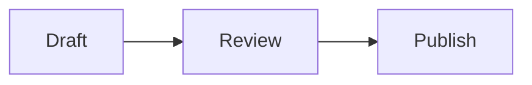

# Mermaid guidance

Author diagrams inside ordinary fenced `mermaid` blocks in a Markdown file:

````markdown

````

Keep node labels short, quote labels containing punctuation, and prefer simple flowcharts, sequences, and state diagrams. The browser-side Markdown viewer renders Mermaid after sanitizing the Markdown output.

If a diagram needs images, publish supported image files first and use the returned absolute URLs in the Markdown. Local filesystem paths are not uploaded or bundled with a board. Do not add external scripts, Mermaid CDN tags, raw initialization code, or SVG uploads.
